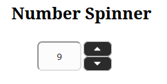
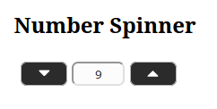

# number-spinner

Control responsive para el ingreso de valores númericos.

La idea es tener un control en el cual el usuario pueda seleccionar un valor entero a través de dos botones (uno más), uno para incrementar y otro para de-crementar dicho valor.

En el aspecto de amigabilidad con el usuario el objetivo es que estos botones tengan un comportamiento de modo que:

- En vista es web aparezcan a la derecha del input uno sobre otro

- En vista móvil aparezca cada botón a un lado del input y en tamaño más grande

Para lograr lo anterior se usa una maquetación combinando las propiedades csss `grid` con `flex` de acuedo a un `media query`
